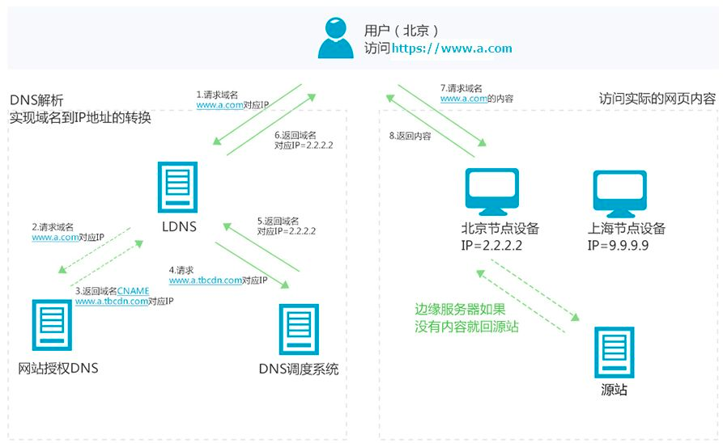

欠的：
- 缓存
- CSP
- CSRF 攻击


### Post 和 Get 的区别？

定义上:
- GET 不会修改服务器状态，是幂等请求
- POST 会修改服务器状态，非幂等（对应的是 PUT，修改但幂等）
- POST 比 GET 性能差（这里指的是 POST 有个等待服务器响应 100 continue，然后再发送 body 的过程、事实上并非必须，完全可以没有这一步）

应用上：
- GET 不使用 body 来传输数据（实际上也并非如此）
- GET 一般会被浏览器、或者中间的服务商缓存，POST 不会
- 由于 GET 会被缓存，所有有一些相关的应用，比如浏览器收藏夹、历史记录
- URL 有长度限制（也是全看具体实现）

### 当你在浏览器中输入 Google.com 并且按下回车之后发生了什么？

```
（1）首先会对 URL 进行解析，分析所需要使用的传输协议和请求的资源的路径。如果输入的 URL 中的协议或者主机名不合法，
将会把地址栏中输入的内容传递给搜索引擎。如果没有问题，浏览器会检查 URL 中是否出现了非法字符，如果存在非法字
符，则对非法字符进行转义后再进行下一过程。

（2）浏览器会判断所请求的资源是否在缓存里，如果请求的资源在缓存里并且没有失效，那么就直接使用，否则向服务器发起新
的请求。

（3）下一步我们首先需要获取的是输入的 URL 中的域名的 IP 地址，首先会判断本地是否有该域名的 IP 地址的缓存，如果
有则使用，如果没有则向本地 DNS 服务器发起请求。本地 DNS 服务器也会先检查是否存在缓存，如果没有就会先向根域
名服务器发起请求，获得负责的顶级域名服务器的地址后，再向顶级域名服务器请求，然后获得负责的权威域名服务器的地
址后，再向权威域名服务器发起请求，最终获得域名的 IP 地址后，本地 DNS 服务器再将这个 IP 地址返回给请求的用
户。用户向本地 DNS 服务器发起请求属于递归请求，本地 DNS 服务器向各级域名服务器发起请求属于迭代请求。

（4）当浏览器得到 IP 地址后，数据传输还需要知道目的主机 MAC 地址，因为应用层下发数据给传输层，TCP 协议会指定源
端口号和目的端口号，然后下发给网络层。网络层会将本机地址作为源地址，获取的 IP 地址作为目的地址。然后将下发给
数据链路层，数据链路层的发送需要加入通信双方的 MAC 地址，我们本机的 MAC 地址作为源 MAC 地址，目的 MAC 地
址需要分情况处理，通过将 IP 地址与我们本机的子网掩码相与，我们可以判断我们是否与请求主机在同一个子网里，如果
在同一个子网里，我们可以使用 APR 协议获取到目的主机的 MAC 地址，如果我们不在一个子网里，那么我们的请求应该
转发给我们的网关，由它代为转发，此时同样可以通过 ARP 协议来获取网关的 MAC 地址，此时目的主机的 MAC 地址应
该为网关的地址。

（5）下面是 TCP 建立连接的三次握手的过程，首先客户端向服务器发送一个 SYN 连接请求报文段和一个随机序号，服务端接
收到请求后向服务器端发送一个 SYN ACK报文段，确认连接请求，并且也向客户端发送一个随机序号。客户端接收服务器的
确认应答后，进入连接建立的状态，同时向服务器也发送一个 ACK 确认报文段，服务器端接收到确认后，也进入连接建立
状态，此时双方的连接就建立起来了。

（6）如果使用的是 HTTPS 协议，在通信前还存在 TLS 的一个四次握手的过程。首先由客户端向服务器端发送使用的协议的版
本号、一个随机数和可以使用的加密方法。服务器端收到后，确认加密的方法，也向客户端发送一个随机数和自己的数字证
书。客户端收到后，首先检查数字证书是否有效，如果有效，则再生成一个随机数，并使用证书中的公钥对随机数加密，然后
发送给服务器端，并且还会提供一个前面所有内容的 hash 值供服务器端检验。服务器端接收后，使用自己的私钥对数据解
密，同时向客户端发送一个前面所有内容的 hash 值供客户端检验。这个时候双方都有了三个随机数，按照之前所约定的加
密方法，使用这三个随机数生成一把秘钥，以后双方通信前，就使用这个秘钥对数据进行加密后再传输。

（7）当页面请求发送到服务器端后，服务器端会返回一个 html 文件作为响应，浏览器接收到响应后，开始对 html 文件进行
解析，开始页面的渲染过程。

（8）浏览器首先会根据 html 文件构建 DOM 树，根据解析到的 css 文件构建 CSSOM 树，如果遇到 script 标签，则判端
是否含有 defer 或者 async 属性，要不然 script 的加载和执行会造成页面的渲染的阻塞。当 DOM 树和 CSSOM 树建
立好后，根据它们来构建渲染树。渲染树构建好后，会根据渲染树来进行布局。布局完成后，最后使用浏览器的 UI 接口对页
面进行绘制。这个时候整个页面就显示出来了。

（9）最后一步是 TCP 断开连接的四次挥手过程。
```

详细资料可以参考：
[《当你在浏览器中输入 Google.com 并且按下回车之后发生了什么？》](http://blog.jobbole.com/84870/)

### 谈谈 CDN 服务？
[《CDN 是什么？使用 CDN 有什么优势？》](https://www.zhihu.com/question/36514327?rf=37353035)

CDN 流程:

1. 用户访问 LDNS（本地DNS服务）
2. 不成功请求远程 DNS 服务，返回一条 CNAME 记录，指向 CDN 服务商的 DNS 调度服务对应的 ip
3. 访问 DNS 调度服务，获取合适的边缘节点 ip 地址
4. 访问边缘节点，获取资源，没有则进行回源，获取源站的资源

### 什么是正向代理和反向代理？

- 正反向是基于客户端向服务器发起请求的这个流程来说的
- 正向: 指隐藏了真实的请求客户端，服务端不知道真实的客户端是谁，客户端请求的
  服务都被代理服务器代替来请求。
- 反向: 指隐藏了真实的服务端，一个请求背后可能有成千上万台服务器为我们服务，反向
  代理器一般用来实现负载平衡。

详细资料可以参考：
[《正向代理与反向代理有什么区别》](https://mp.weixin.qq.com/s/ikrI3rmSYs83wdSWqq2QIg?)
[《webpack 配置 proxy 反向代理的原理是什么？》](https://segmentfault.com/q/1010000017502539/a-1020000017532348)

### HTTP 1.0, 1.1, 2.0 之间有哪些区别？
> HTTP 的优化方向：带宽、延迟

HTTP 1.0 => HTTP 1.1 变化：
- 连接方面：http1.1 默认使用持久连接（keep-alive），多个 http 请求复用同一个 TCP 连接。
- 资源请求方面：http1.1 则在请求头引入了 range 头域，它允许只请求资源的某个部分，即返回码是 206（Partial Content），这样就方便了开发者自由的选择以便于充分利用带宽和连接。
- 缓存方面的区别： 
  - http1.0 中主要使用 header 里的 If-Modified-Since, Expires 来做为缓存判断的标准
  - http1.1 则引入了更多的缓存控制策略例如 Etag、If-Unmodified-Since、If-Match、If-None-Match 等更多可供选择的缓存头来控制缓存策略。
- http1.1 中还新增了 host 字段，用来指定服务器的域名。http1.0 中认为每台服务器都绑定一个唯一的 IP 地址，因此，请求消息中的 URL 并没有传递主机名（hostname）。但随着虚拟主机技术的发展，在一台物理服务器上可以存在多个虚拟主机，并且它们共享一个IP地址。因此有了 host 字段，就可以将请求发往同一台服务器上的不同网站。
- 请求方法新增：如 PUT、HEAD、OPTIONS 等

HTTP 1.1 => HTTP 2.0 变化：
- 新的二进制格式(Binary Format)：2.0 基于二进制解析，1.x 基于文本解析
- 多路服用: 一个request对应一个id，这样一个连接上可以有多个request（类似CPU时间片）
  - 降低了慢启动的影响（只有一个链接，越来越快）
- header 压缩
- 服务端推送
  - 需要主动配置（nginx: http2_push /style.css;）

详细资料可以参考：
[《HTTP1.0、HTTP1.1 和 HTTP2.0 的区别》](https://juejin.im/entry/5981c5df518825359a2b9476)
[《HTTP 协议入门》](http://www.ruanyifeng.com/blog/2016/08/http.html)
[《网络---一篇文章详解请求头 Host 的概念》](https://blog.csdn.net/netdxy/article/details/51195560)
[阮一峰 HTTP/2 服务器推送（Server Push）教程](https://www.ruanyifeng.com/blog/2018/03/http2_server_push.html)

### 网站域名加 www 与不加 www 的区别？
- 没有 www 的裸域名
  - 无法需要无法绑定 CNAME 记录（即无法指向其他域名，当作别名）
  - 只能制定一个 A 记录 （ip 地址）

详细资料可以参考：
[《为什么越来越多的网站域名不加「www」前缀？》](https://www.zhihu.com/question/20414602)

### TCP 慢启动
不知道可用带宽是多少，TCP在连接建立成功后如果发送大量的数据包，很容易导致网络拥塞。  
因此新建立的连接不能够一开始就大量发送数据包，而只能根据网络情况逐步增加每次发送的数据量，以避免上述现象的发生。

### TCP 队头阻塞
HTTP/1.1 中增加了持久连接的方法，它的特点是在一个 TCP 连接上可以传输多个 HTTP 请求，只要浏览器或者服务器没有明确断开连接，那么该 TCP 连接会一直保持。
HTTP 的持久连接可以有效减少 TCP 建立连接和断开连接的次数，这样的好处是减少了服务器额外的负担，并提升整体 HTTP 的请求时长。
持久连接虽然能减少 TCP 的建立和断开次数，但是它需要等待前面的请求返回之后，才能进行下一次请求。如果 TCP 通道中的某个请求因为某些原因没有及时返回，那么就会阻塞后面的所有请求，这就是著名的队头阻塞的问题。

我们知道 HTTP/1.1 为网络效率做了大量的优化，最核心的有如下三种方式：
- 增加了持久连接
- 浏览器为每个域名最多同时维护 6 个 TCP 持久连接 (看浏览器实现)
- 使用 CDN 的实现域名分片机制

### HTTP/2的多路复用
前面我们分析了 HTTP/1.1 所存在的一些主要问题：慢启动和 TCP 连接之间相互竞争带宽是由于 TCP 本身的机制导致的，而队头阻塞是由于 HTTP/1.1 的机制导致的。

那么该如何去解决这些问题呢？
虽然 TCP 有问题，但是我们依然没有换掉 TCP 的能力，所以我们就要想办法去规避 TCP 的慢启动和 TCP 连接之间的竞争问题。
基于此，HTTP/2 的思路就是一个域名只使用一个 TCP 长连接来传输数据，这样整个页面资源的下载过程只需要一次慢启动，同时也避免了多个 TCP 连接竞争带宽所带来的问题。
多路复用可以将请求分成一帧一帧的传送，每一帧都有对应的ID，浏览器接收后，会筛选出相同ID的内容将其拼接为完成的http响应数据
另外，就是队头阻塞的问题，等待请求完成后才能去请求下一个资源，这种方式无疑是最慢的，所以 HTTP/2 需要实现资源的并行请求，也就是任何时候都可以将请求发送给服务器，而并不需要等待其他请求的完成，然后服务器也可以随时返回处理好的请求资源给浏览器。

1.可以设置请求的优先级
我们知道浏览器中有些数据是非常重要的，但是在发送请求时，重要的请求可能会晚于那些不怎么重要的请求，如果服务器按照请求的顺序来回复数据，那么这个重要的数据就有可能推迟很久才能送达浏览器，这对于用户体验来说是非常不友好的。
为了解决这个问题，HTTP/2 提供了请求优先级，可以在发送请求时，标上该请求的优先级，这样服务器接收到请求之后，会优先处理优先级高的请求。

2.服务器推送
除了设置请求的优先级外，HTTP/2 还可以直接将数据提前推送到浏览器。你可以想象这样一个场景，当用户请求一个 HTML 页面之后，服务器知道该 HTML 页面会引用几个重要的 JavaScript 文件和 CSS 文件，那么在接收到 HTML 请求之后，附带将要使用的 CSS 文件和 JavaScript 文件一并发送给浏览器，这样当浏览器解析完 HTML 文件之后，就能直接拿到需要的 CSS 文件和 JavaScript 文件，这对首次打开页面的速度起到了至关重要的作用。

3. 头部压缩
无论是 HTTP/1.1 还是 HTTP/2，它们都有请求头和响应头，这是浏览器和服务器的通信语言。HTTP/2 对请求头和响应头进行了压缩，你可能觉得一个 HTTP 的头文件没有多大，压不压缩可能关系不大，但你这样想一下，在浏览器发送请求的时候，基本上都是发送 HTTP 请求头，很少有请求体的发送，通常情况下页面也有 100 个左右的资源，如果将这 100 个请求头的数据压缩为原来的 20%，那么传输效率肯定能得到大幅提升。

### HTTPS 相关
[资料](https://juejin.cn/post/6844903781704925198#heading-16)

特点：
HTTPS 在 TCP 和 HTTP 中间加了一层 TLS/SSL，所以基本不需要改造原有的代码

整个 HTTPS 建立链接过程：  
> 非对称加密协商出一份密钥，然后使用这个密钥进行通信（保证安全的同时保证了效率）
1. 客户端发起请求
   1. 提供自己支持的协议类型（例：RSA）
   2. 提供一个随机数
2. 服务端回应
   1. 自己的证书（包含了公钥）
   2. 提供一个随机数
   3. 确认加密方法
3. 客户端再回应
   1. 校验证书可靠性（可信才会继续）
   2. 编码改变标志（之后的通信要用协商好的算法加密了！）
   3. 客户端握手结束标志（客户端建立链接成功了！）
   4. 提供一个随机数
4. 服务端再回应
   1. 私钥解密信息
   2. 编码改变标志
   3. 服务端握手结束标志
   
### TLS/SSL 中什么一定要用三个随机数，来生成"会话密钥"？

- 最终通信是对称加密
- 需要一个随机数来生成密钥
- 单台机器生成的随机数不可靠
- 最终采用了两台机器共三个随机数的方式来生成，保证密钥随机和安全

### SSL 连接断开后如何恢复？

```
一共有两种方法来恢复断开的 SSL 连接，一种是使用 session ID，一种是 session ticket。

使用 session ID 的方式，每一次的会话都有一个编号，当对话中断后，下一次重新连接时，只要客户端给出这个编号，服务器
如果有这个编号的记录，那么双方就可以继续使用以前的秘钥，而不用重新生成一把。目前所有的浏览器都支持这一种方法。但是
这种方法有一个缺点是，session ID 只能够存在一台服务器上，如果我们的请求通过负载平衡被转移到了其他的服务器上，那
么就无法恢复对话。

另一种方式是 session ticket 的方式，session ticket 是服务器在上一次对话中发送给客户的，这个 ticket 是加密的
，只有服务器能够解密，里面包含了本次会话的信息，比如对话秘钥和加密方法等。这样不管我们的请求是否转移到其他的服务器
上，当服务器将 ticket 解密以后，就能够获取上次对话的信息，就不用重新生成对话秘钥了。
```

### RSA 算法的安全性保障？

```
对极大整数做因数分解的难度决定了 RSA 算法的可靠性。换言之，对一极大整数做因数分解愈困难，RSA 算法愈可靠。现在102
4位的 RSA 密钥基本安全，2048位的密钥极其安全。
```
